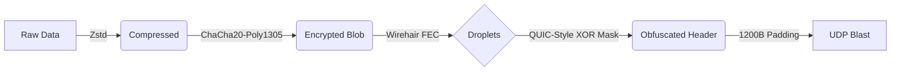

# Kyu2: Zen-Mode UDP Transport Protocol

**Kyu2** is a next-generation, high-performance reliable UDP transport protocol designed for the **Nomikai** project. It combines modern cryptography, fountain codes, and compression into a single "Zero-State" pipeline.

> *"The Master does nothing, yet he leaves nothing undone"*


## 🌊 Architecture

Kyu2 uses a unique "Squeeze, Seal, & Spray" pipeline to ensure data integrity and confidentiality over unreliable networks.



1.  **Compression (Squeeze):** Data is compressed using Zstandard (tANS).
2.  **Encryption (Seal):** Authenticated encryption via ChaCha20-Poly1305 using X25519-derived directional session keys.
3.  **Forward Error Correction (Spray):** Data is encoded using **Wirehair** (O(N) Fountain Code), allowing recovery from any subset of packets.
4.  **Header Protection (Mask):** The packet geometry is XOR-masked using a dynamic nonce derived from the encrypted payload, preventing stream tracking.
5.  **Traffic Obfuscation:** Every network packet is padded to exactly 1200 bytes. An observer cannot distinguish between file transfers, handshakes, or silence.

---

## 🚀 Features

* **Multiplexing:** Send hundreds of files simultaneously over a single UDP port. Head-of-Line (HoL) blocking is mathematically eliminated.
* **1-RTT + 0-RTT Handshakes:** New clients use PSK-authenticated X25519; recently authenticated clients can resume with encrypted tickets for 0-RTT startup.
* **0-RTT Anti-Replay Guard:** Receivers reject duplicate ticket-id + client-nonce binder tuples until ticket expiry.
* **Self-Healing Mesh:** Intermediate relay nodes can recover and mathematically regenerate fresh packets for destination nodes.
* **Adversarial Resistance:** Packet sizes are static (1200B), and sequence numbers are encrypted.
* **Stateless Decoding:** Every packet contains enough masked geometry to initialize a decoder.
* **Operational Telemetry:** Structured faults, metrics, and trace IDs are emitted for stream/session visibility.

---

## 🛠️ Installation & Usage

Ensure you have Rust and Cargo installed.

```bash
cargo build --release -p kyu2-cli
```

Set a shared PSK (same value on sender and receiver):
```bash
export KYU2_PSK=00112233445566778899aabbccddeeff00112233445566778899aabbccddeeff
```

**Receiver (Listen on Port 8080):**
```bash
./target/release/kyu2-cli recv --bind 0.0.0.0:8080 --out-dir ./downloads
```

**Sender (Send a file):**
```bash
./target/release/kyu2-cli send my_video.mp4 --dest 127.0.0.1:8080
```

**Sender (Multiplex multiple files over one session):**
```bash
./target/release/kyu2-cli send movie.mp4 archive.tar logs.zip --dest 127.0.0.1:8080 --redundancy 1.5
```

**Sender ticket persistence (for 0-RTT resumption across process restarts):**
```bash
# First run stores a fresh ticket
./target/release/kyu2-cli send intro.mov --dest 127.0.0.1:8080 --ticket-out ./client.ticket

# Later run reuses the ticket for 0-RTT resume
./target/release/kyu2-cli send call_segment.bin --dest 127.0.0.1:8080 --ticket-in ./client.ticket --ticket-out ./client.ticket
```

**Receiver with explicit ticket key (recommended for persistent deployments):**
```bash
./target/release/kyu2-cli recv --bind 0.0.0.0:8080 --out-dir ./downloads --psk $KYU2_PSK --ticket-key 8899aabbccddeeff00112233445566778899aabbccddeeff0011223344556677
```
Persist `--ticket-key` in platform secure storage (for example, iOS Keychain) so restarted nodes can continue validating previously issued tickets.

**Relay (Recover and regenerate fresh packets to the next hop):**
```bash
./target/release/kyu2-cli relay --bind 0.0.0.0:8081 --forward 10.0.0.2:8080 --spool-dir ./relay_spool
```

**Structured JSON output (for dashboards/log pipelines):**
```bash
./target/release/kyu2-cli --json recv --bind 0.0.0.0:8080 --out-dir ./downloads
```

---

## 📦 Project Structure

* `kyu2-core`: The safe Rust library exposing a clean, event-driven API (`KyuSender` / `KyuReceiver`). Ready for GUI integration.
* `kyu2-cli`: The command-line interface driver.
* `kyu2-wirehair-sys`: Low-level C++ bindings to the Wirehair FEC engine.

## 📚 Engineering Policies

* `PROTOCOL_EVOLUTION.md`: Compatibility, versioning, and deprecation policy.
* `BUILD_REPRODUCIBILITY.md`: Lockfile, CI gates, and reproducibility rules.

## 📜 License

MIT License. See `LICENSE` for details.
